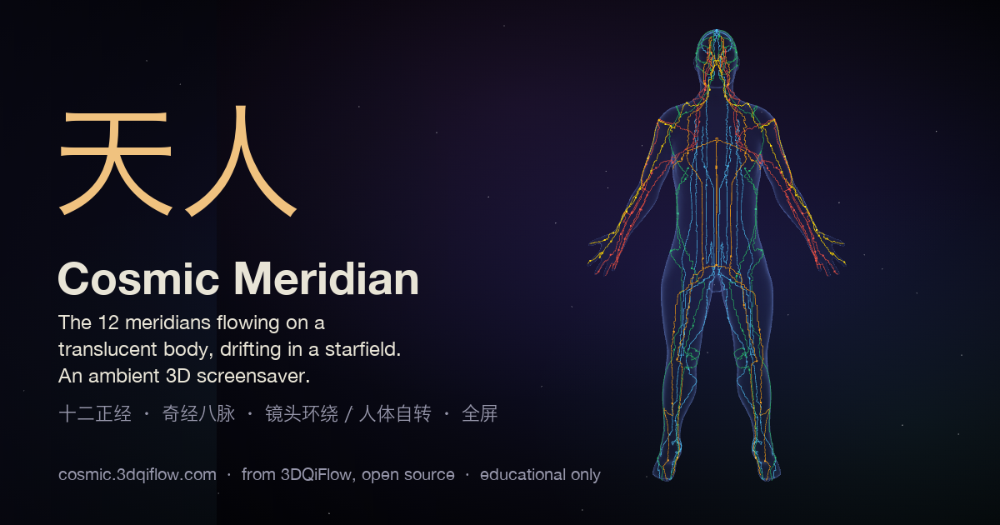

# 天人 · Cosmic Meridian

**https://cosmic.3dqiflow.com** — a translucent human body floats in a starfield while the
twelve meridians flow in slow qi. Nothing to click; leave it on a second screen, a wall
display, or full-screen as a screensaver.



## What it does

- **Two motions, or both** — the camera orbits the body (horizontal · elevated · spherical
  drift · free sphere), or the body turns on its own axis (Y · X · Z · three-axis drift ·
  custom yaw/pitch/roll, full turn or ±180/90/45°), or both at once.
- **Meridian picker** — the 12 regular meridians by default; add the 8 extraordinary
  vessels (任/督/衝/帶/蹻/維) or narrow to hand/foot/yin/yang sixes, or single channels.
- **Slow by design** — qi flow defaults to 0.1×, orbit 0.1× (one revolution ≈ 7 min), spin
  0.25×. Everything is a slider: body size and transparency, camera distance, elevation,
  field of view 25–70°.
- **Ambient UI** — the ⚙ and ⛶ controls fade after 4 s of stillness; the cursor hides.
  Drag to look around when "Manual interaction" is on; it eases back into motion.
- **Stays awake** — while the page is visible it holds a Screen Wake Lock (where the
  browser supports it), so the display doesn't sleep under it. Close the tab to release.
- **Fits any screen** — portrait phones and tablets frame the whole body width-first;
  landscape and ultrawide keep the default framing.
- **English / 中文**, settings remembered locally (`3dqiflow:screensaver`), no accounts,
  no tracking.

## Time & Sound (opt-in)

Off by default. Turn it on in ⚙ → *Time & Sound* and the page becomes time-aware:

- **Meridian clock** — your local time selects the current 时辰 (two-hour period) and its
  meridian (子 Gallbladder → 丑 Liver → 寅 Lung → … → 亥 Triple Energizer). That channel is
  gently emphasized; the other eleven stay alive. Transitions crossfade over 5–20 minutes.
- **Generative soundscape** — synthesized in the browser with Web Audio, no samples, no loop (engine open source; the composition is the private sound pack, see below).
  A sub-perceptual 宫 (Gong) foundation holds the centre; the Five Tone traditionally
  associated with the current meridian (宫商角徵羽 ↔ 土金木火水) becomes the modal centre,
  with sparse motifs that rise for Wood, float for Fire, hold for Earth, descend for Metal
  and sink for Water. One click is needed to start audio (browser autoplay policy).
- **Vessels shape the space** — the eight extraordinary vessels never get tones; when
  shown on the body they modulate the field instead: 任 depth and warmth, 督 brightness and
  lift, 衝 a slow 8–12 s pulse, 帶 a gentle stereo orbit (Off / Subtle / Full), the 蹻 and 維
  pairs pan, pacing, glue and motion. An artistic mapping, documented as such.
- **Time overlay** — faint, bottom-left: time · 时辰 · meridian · tone. Minimal / detailed /
  hidden. Manual 时辰 and a compressed 24-hour preview are available for exploring.

The 12-period clock is the common teaching model, not the full 子午流注 system; the
tone-to-element mapping follows the *Suwen*, while the synth characters are artistic
choices. Nothing here treats, diagnoses, or "activates" anything.

## Use it as a screensaver or live wallpaper

- **Any browser** — press ⛶ (or F11 / ⌃⌘F) for fullscreen. The page keeps the screen awake.
- **Phone / tablet home screen** — Safari or Chrome → *Add to Home Screen*. It launches
  fullscreen without browser chrome (web app manifest, `display: fullscreen`).
- **macOS desktop wallpaper** — [Plash](https://github.com/sindresorhus/Plash) (free, open
  source) shows any URL as your wallpaper: add `https://cosmic.3dqiflow.com`.
- **Windows** — [Lively Wallpaper](https://github.com/rocksdanister/lively) (free, open
  source): *Add wallpaper → URL*. Wallpaper Engine users: *Open wallpaper → Web page*.
- **Kiosk / wall display** — any Chromium in `--kiosk https://cosmic.3dqiflow.com`; a
  Raspberry Pi 4/5 runs it at 1080p.
- Native screensaver wrappers (macOS `.saver`, Electron) are on the wish-list — PRs welcome.

## Open core: what is open, what is not

- **Open (MIT)**: the whole visualization, the meridian clock (`src/temporal/`), and the audio
  *engine* — Web Audio graph, synth voices, scheduler, controller (`src/audio/`), plus a plain
  **reference sound pack** (`src/audio/fallback/`) so this repo builds and plays on its own.
- **Not open**: the *composition* — element characters and day/night palettes, the harmonic
  progression and 时辰 cadence, the eight-vessel modulation map, and the level balance. That is
  the private `cosmic-sound` pack, overlaid into `src/audio/pack/` at deploy time by
  `scripts/fetch-sound-pack.mjs`. cosmic.3dqiflow.com runs with it; a local build without it
  runs the reference pack and says so in the debug panel (`?debug`).
- Same model as the engine's content pack: see `NOTICE.md`.

## Where it comes from

This is the *Cosmic / 天人* page of [3DQiFlow](https://www.3dqiflow.com)
([MuzikPro/3dqiflow](https://github.com/MuzikPro/3dqiflow)) lifted into a one-page site.
The body (NIH Visible Human derived), the meridian polylines, the acupoint registry and
the flow animation are the **same sources** and are copied verbatim from 3dqiflow (please
open engine issues and PRs there). The screensaver itself, the meridian clock
(`src/temporal/`) and the audio engine (`src/audio/`) live **here** and are the source of
truth for this site.

Meridian routes are schematic teaching geometry, not clinical landmarks: see
[NOTICE.md](NOTICE.md) and [public/models/README.md](public/models/README.md) for
provenance and licences.

## Run it

```bash
npm ci
npm run dev      # http://localhost:5177
npm run build    # dist/
```

Vite + React 18 + TypeScript + three.js (React Three Fiber). Needs WebGL2.

## Not medical advice

Educational and decorative. It does not diagnose, prescribe, or locate points for
treatment. Licence: see [LICENSE](LICENSE).
